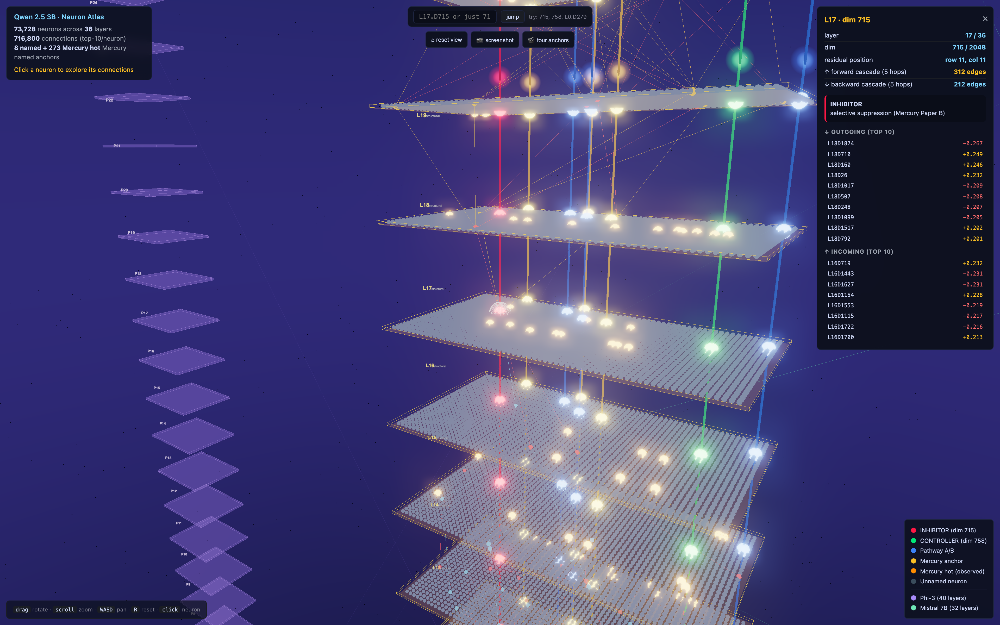
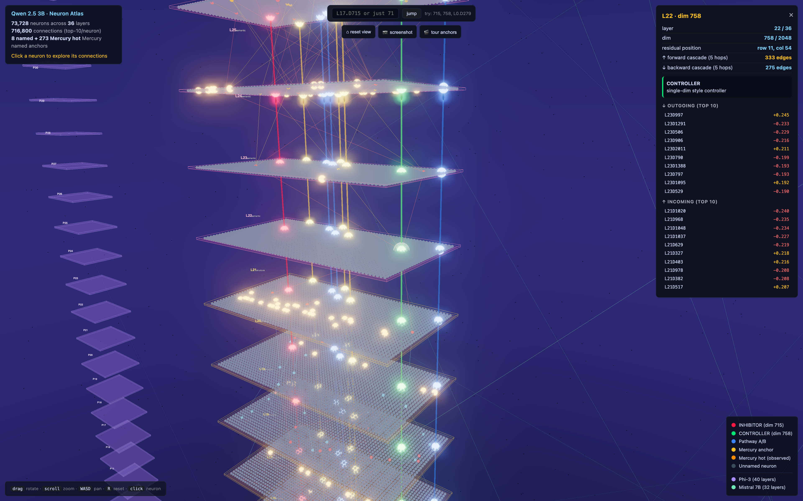
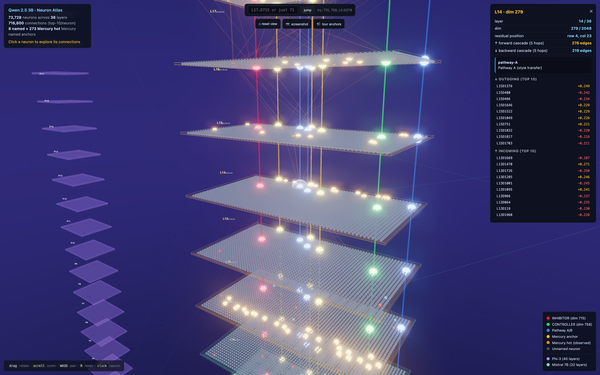

<div align="center">

# LLM Neuron Atlas

### 3D explorable atlas of every neuron in a transformer LLM

[](https://charenix.com/qwen3b-atlas)
[](LICENSE)
[](https://huggingface.co/Qwen/Qwen2.5-3B)
[](https://doi.org/10.5281/zenodo.20352085)

**Click a neuron. See its signal cascade through 36 layers. Trace residual highways. Compare cross-architecture conservation.**



</div>

---

## What this is

The first 3D explorable visualization of a full multi-billion parameter LLM at the per-neuron level. The mental model is Google Maps for a transformer:

・**Zoom out** to see the 36-floor tower, one floor per transformer layer
・**Zoom in** to see 2048 neurons rendered on each floor
・**Click a neuron** for its top-10 outgoing and incoming connections
・**Follow a residual highway** as the same dim travels through all 36 layers
・**Compare** with Phi-3 (left tower) and Mistral 7B (right tower) for cross-architecture conservation

Existing LLM viz tools (BertViz, Neuronpedia, SAE feature dashboards, Anthropic circuits) are all 2D and focus on a slice. This shows the whole thing.

---

## Live demo

**[charenix.com/qwen3b-atlas](https://charenix.com/qwen3b-atlas)**

Loads in 5 to 10 seconds. Auto-jumps to dim 715 (the Mercury INHIBITOR) on open. Try the search box top-center: type `715` or `L22.D758` to fly anywhere.

---

## What you see

<table>
<tr>
<td width="50%">


**dim 758 (CONTROLLER)** at layer 22. The green highway runs from L0 to L35. Click it, see how a single dim controls style transfer.

</td>
<td width="50%">


**dim 279 (Pathway A)** at layer 14. Blue highway carries functional control. Cascade traces show how its signal branches forward and backward through layers.

</td>
</tr>
</table>

The 5 layer regions are colored after Mercury Tier-B analysis:

| Layers | Region | Color | Role |
|---|---|---|---|
| L0 to L3 | embed-detok | blue | token embedding & early detokenization |
| L4 to L11 | surface | green | surface-form & syntactic features |
| L12 to L21 | structural | yellow | structural & dependency tracking |
| L22 to L31 | semantic | pink | semantic abstraction (Mercury hot zone) |
| L32 to L35 | output | orange | output projection & decoding |

8 named anchors (Mercury Paper B):

| Dim | Name | Role |
|---|---|---|
| 715 | **INHIBITOR** | selective suppression, fires on negation |
| 758 | **CONTROLLER** | single-dim style controller |
| 279, 382, 476 | **Pathway A/B** | functional control pathways |
| 11, 25, 481 | conserved anchors | survive Qwen 0.5B to 72B |

---

## Quickstart

```bash
git clone https://github.com/norika1207-lab/llm-neuron-atlas
cd llm-neuron-atlas
pip install -r requirements.txt

# 1. download Qwen 2.5 3B (6 GB, takes a few minutes)
huggingface-cli download Qwen/Qwen2.5-3B --local-dir weights/Qwen2.5-3B

# 2. bake the graph (85 seconds on CPU)
python bake/extract_graph.py --weights weights/Qwen2.5-3B --out viewer/graph

# 3. serve viewer locally
cd viewer && python -m http.server 8000
```

Then open `http://localhost:8000`.

---

## How the bake works

9 steps, 250 lines of Python.

```text
1. mmap-load Qwen 2.5 3B safetensors via the safetensors lib
2. For each layer L, read 7 weight tensors:
     q_proj, k_proj, v_proj, o_proj, gate_proj, up_proj, down_proj
3. Compute effective MLP transfer:  M = down_proj @ gate_proj
     M[D', D] = linear contribution of layer L's dim D
                to layer L+1's dim D'
4. For each dim D, keep top-10 strongest outgoing edges by |weight|
5. Tag 8 Mercury-named anchors with roles (715 INHIBITOR, 758 CONTROLLER, etc)
6. Tag 300 Mercury Tier-B observed hot neurons
7. Emit nodes.json (73K) + edges.json (716K) + highways.json + meta.json
8. Serve as static files (any HTTP server works)
9. Viewer fetches all four JSONs, renders via three.js InstancedMesh + bloom
```

Total output: 117 MB JSON, gzipped to about 35 MB. Bake is CPU-bound (matrix multiplication + np.argpartition), GPU not used.

---

## Adapt to other models

The bake script is written for Qwen 2.5 family. Porting is small:

| Model family | What changes |
|---|---|
| Llama 2/3 family | nothing, tensor names match |
| Mistral 7B | nothing, tensor names match |
| Phi-3 | adjust `HIDDEN`, `N_LAYERS`, `INTERMEDIATE` constants |
| GPT-2 family | rename `gate_proj` to `c_fc`, `down_proj` to `c_proj`, remove `up_proj` |
| MoE (Mixtral / DBRX) | need to aggregate across experts, not yet supported |

Pull requests welcome for new model families.

---

## Performance

| Metric | Value |
|---|---|
| Bake time (Qwen 3B, modern CPU) | 60 to 120 seconds |
| Output size | 117 MB JSON, gzip 35 MB |
| Viewer load time | 5 to 10 seconds on broadband |
| Viewer FPS | 60 on M2 MacBook Air, 30 on older laptops |
| Browser RAM peak | about 250 MB |

For Llama 70B (about 175K neurons, 1.75M edges): expect 300 MB output, 1 GB browser RAM, still works if you raise the top-K filter.

---

## Repository layout

```
llm-neuron-atlas/
├── bake/
│   └── extract_graph.py     # bake pipeline, ~250 lines
├── viewer/
│   └── index.html           # self-contained viewer (three.js via importmap)
├── examples/
│   ├── qwen3b-meta.json     # tiny sample data for offline preview
│   ├── qwen3b-highways.json
│   └── qwen3b-hotness.json
├── docs/                    # screenshots
├── README.md
├── LICENSE                  # MIT
└── requirements.txt
```

No build step. No bundler. One HTML file loads three.js from esm.sh via importmap.

---

## Mercury observability cited

The 8 named anchors come from prior Mercury work:

・**Paper A** — cross-architecture conservation (anchor dims survive across Qwen 2.5 family from 0.5B to 72B)
・**Paper B** — functional control via single-dim subspace rescue (dim 715 INHIBITOR + dim 758 CONTROLLER mechanism)

Both available on Zenodo: [10.5281/zenodo.20352085](https://doi.org/10.5281/zenodo.20352085)

---

## What's next

**Phase 2** is live forward-pass overlay. You type "I do not like cats", the atlas lights up. The red dim 715 highway flashes. You type "I like cats", it stays dark. Personal browser-based reproduction of the Mercury Paper B inhibitor claim, no Python required.

That kind of interactive supplementary material has not appeared in ML peer review before.

---

## Citation

```bibtex
@software{oda2026llmatlas,
  author  = {Oda, Norika},
  title   = {LLM Neuron Atlas: 3D explorable visualization of transformer internals},
  year    = {2026},
  url     = {https://github.com/norika1207-lab/llm-neuron-atlas}
}

@misc{oda2026mercury,
  author = {Oda, Norika},
  title  = {Mercury MCP v0.1: LLM observability findings},
  year   = {2026},
  doi    = {10.5281/zenodo.20352085}
}
```

---

## Contact

Bugs, questions, model-family ports: [GitHub issues](https://github.com/norika1207-lab/llm-neuron-atlas/issues).

Author: **Norika Oda**
・ORCID [0009-0006-6816-9891](https://orcid.org/0009-0006-6816-9891)
・[Google Scholar](https://scholar.google.com/citations?user=wrTR3VMAAAAJ)
・GitHub [@norika1207-lab](https://github.com/norika1207-lab)
